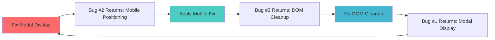
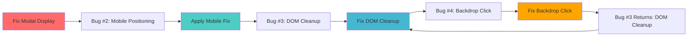

# PostCreationShare Circular Bug Dependency - Complete Analysis & Resolution

## 🔄 The Circular Dependency Problem

**CRITICAL ISSUE**: Three distinct bugs formed a circular dependency where fixing one would reintroduce another, creating an "endless loop" of regressions that made the post-creation flow completely unusable.

## 🐛 The Three Interconnected Bugs

### Bug #1: Modal Display Failure (Race Condition)
**Root Cause**: Component lifecycle race condition in CreateMarketForm.tsx
```tsx
// PROBLEMATIC CODE (lines 270-273)
onSuccess?.(newMarket);  // Triggers PostCreationShare state update
onClose?.();             // Immediately unmounts Dialog before PostCreationShare can render
```

**Symptoms**:
- PostCreationShare modal never appears after circle creation
- Users redirected to markets page with no success indication
- Subsequent "Create Circle" clicks show stale modal data
- Complete UI whiteout when stale modal appears

**Impact**: Complete failure of post-creation success flow

### Bug #2: Mobile Positioning Displacement (CSS Math Error)
**Root Cause**: CSS `calc()` + `transform: translateX(-50%)` mathematical interaction
```css
/* THE MATHEMATICAL ERROR */
width: calc(100vw - 32px)     /* ~358px on 390px mobile */
left: 50%                     /* 195px from left */
transform: translateX(-50%)   /* -179px (50% of 358px, NOT viewport!) */
final-position: 195px - 179px = 16px from left  /* DISPLACED! */
```

**Symptoms**:
- Modal completely invisible on mobile devices
- Displaced so far outside viewport that users must zoom out extensively to see it
- Perfect positioning on desktop, broken on mobile
- Appears as tiny element in bottom-right when zoomed out

**Impact**: Complete mobile UX failure

### Bug #3: DOM Cleanup Error (Portal Conflicts)
**Root Cause**: Multiple portal systems interfering during cleanup
```javascript
// ERROR MESSAGE
"Failed to execute 'removeChild' on 'Node': The node to be removed is not a child of this node."
```

**Systems in Conflict**:
1. **PostCreationShare Portal** - Main modal rendering
2. **CelebrationImageGenerator Portal** - Hidden canvas for image generation  
3. **Download Link DOM Manipulation** - Temporary anchor elements

**Symptoms**:
- Error when clicking outside modal to close
- Component cleanup timing conflicts
- DOM nodes being removed by multiple systems simultaneously

**Impact**: Runtime errors and potential memory leaks

## 🔄 The Circular Dependency Cycle



**The Vicious Cycle**:
1. **Fix Bug #1** (Modal Display) → **Bug #2 Returns** (Mobile Positioning)
2. **Fix Bug #2** (Mobile Positioning) → **Bug #3 Returns** (DOM Cleanup)  
3. **Fix Bug #3** (DOM Cleanup) → **Bug #1 Returns** (Modal Display)

**Why This Happened**:
- Each fix addressed symptoms rather than root architectural issues
- Competing solutions that couldn't coexist
- Lack of comprehensive understanding of all three systems

## 🎯 Root Cause Analysis

### Architectural Issues That Enabled the Cycle

#### 1. **Dual Portal System Conflicts**
```tsx
// CONFLICTING PORTALS
PostCreationShare → createPortal(modalContent, document.body)
CelebrationImageGenerator → ReactDOM.createPortal(<canvas>, document.body)
Download Function → document.body.appendChild(link)
```
**Problem**: Multiple systems manipulating document.body DOM simultaneously

#### 2. **CSS Positioning System Conflicts**
```tsx
// CONFLICTING POSITIONING STRATEGIES
Strategy A: Radix UI Dialog with CSS classes
Strategy B: Custom modal with flexbox
Strategy C: Pure inline styles with transforms
```
**Problem**: Each strategy fighting for positioning control

#### 3. **Component Lifecycle Timing Issues**
```tsx
// TIMING RACE CONDITIONS
CreateMarketForm.onSuccess() → setState → trigger PostCreationShare
CreateMarketForm.onClose() → unmount Dialog → prevent PostCreationShare
```
**Problem**: Sequential operations with competing side effects

#### 4. **Mobile vs Desktop CSS Calculation Inconsistencies**
```css
/* VIEWPORT CALCULATION HELL */
calc(100vw - 32px)  /* Different results on mobile vs desktop */
transform: translateX(-50%)  /* Percentage based on element width, not viewport */
```
**Problem**: Mathematical assumptions that don't hold across devices

## ✅ The Comprehensive Solution

### Breaking the Cycle Through Architectural Overhaul

#### 1. **Single Portal Strategy**
```tsx
// BEFORE: Multiple competing portals
PostCreationShare → Radix Dialog Portal
CelebrationImageGenerator → Separate Portal  
Download → DOM manipulation

// AFTER: Unified portal approach
PostCreationShare → Single createPortal with all functionality contained
```

#### 2. **Pure Inline Style Positioning**
```tsx
// BEFORE: CSS class conflicts
className="fixed top-1/2 left-1/2 -translate-x-1/2 -translate-y-1/2"

// AFTER: CSS cascade immunity
style={{
  position: 'fixed', top: 0, left: 0, width: '100vw', height: '100vh',
  display: 'flex', alignItems: 'center', justifyContent: 'center'
}}
```

#### 3. **Component Lifecycle Management**
```tsx
// BEFORE: No lifecycle protection
const handleClose = () => { onClose(); };

// AFTER: Comprehensive lifecycle tracking
const isMountedRef = useRef(true);
const handleClose = () => {
  if (!isMountedRef.current) return;
  isMountedRef.current = false;
  // Safe cleanup operations
  onClose();
};
```

#### 4. **Enhanced DOM Manipulation Safety**
```tsx
// BEFORE: Basic DOM manipulation
document.body.appendChild(link);
document.body.removeChild(link);

// AFTER: Multi-layered safety
if (isMountedRef.current && link.parentNode === document.body) {
  document.body.removeChild(link);
} else if (link && link.remove) {
  link.remove(); // Fallback method
}
```

## 🛡️ Prevention Framework for Future Development

### 1. **Modal Development Guidelines**

#### ✅ DO:
- Use single portal approach when possible
- Implement component lifecycle tracking (`useRef` for mount status)
- Use pure inline styles for critical positioning
- Test on both mobile and desktop during development
- Implement multiple cleanup strategies for DOM manipulation

#### ❌ DON'T:
- Mix multiple positioning strategies (CSS classes + inline styles + transforms)
- Create multiple portal systems that manipulate the same DOM area
- Perform DOM operations without checking component mount status
- Use `calc()` with percentage transforms for critical positioning
- Assume desktop CSS calculations work the same on mobile

### 2. **Testing Checklist for Modal Components**

```markdown
## Pre-deployment Checklist
- [ ] Modal displays correctly after triggering action
- [ ] Modal positions correctly on mobile (375px viewport)
- [ ] Modal positions correctly on desktop (1200px+ viewport)
- [ ] Clicking outside modal closes without errors
- [ ] No console errors during modal lifecycle
- [ ] No memory leaks from uncleaned resources
- [ ] Modal works after multiple open/close cycles
- [ ] Background content doesn't shift when modal opens
```

### 3. **Code Patterns to Watch For**

#### 🚨 **Red Flags** (Circular Dependency Risk):
```tsx
// Multiple portal creations
createPortal(content1, document.body)
ReactDOM.createPortal(content2, document.body)

// Mixed positioning strategies
className="fixed top-1/2 left-1/2" style={{position: 'absolute'}}

// Unprotected DOM manipulation
document.body.appendChild(element)
document.body.removeChild(element)

// Sequential state operations without coordination
onSuccess(data);
onClose();
```

#### ✅ **Safe Patterns**:
```tsx
// Single portal with contained functionality
createPortal(<CompleteModal />, document.body)

// Consistent positioning strategy
style={{ position: 'fixed', display: 'flex', /* ... */ }}

// Protected DOM operations
if (isMountedRef.current && element.parentNode) {
  element.parentNode.removeChild(element);
}

// Coordinated state management
onSuccess(data); // Let parent handle coordination
```

## 📚 Technical Lessons Learned

### 1. **CSS Transform Mathematics**
- `transform: translateX(-50%)` calculates percentage from **element width**, not viewport
- Never combine `calc()` width with percentage transforms
- Use flexbox centering instead of transform calculations when possible

### 2. **React Portal Behavior**
- Multiple portals to same target can conflict
- Portal cleanup timing is critical
- Always use component lifecycle protection for portal operations

### 3. **Mobile Browser Quirks**
- Viewport units behave differently across mobile browsers
- CSS cascade specificity matters more on mobile
- Transform contexts are more fragile on mobile

### 4. **Component Lifecycle in Modals**
- Modal components can unmount during state transitions
- Always track component mount status for async operations
- Use multiple cleanup strategies for robustness

## 🔮 Future-Proofing Strategies

### 1. **Architectural Principles**
- **Single Responsibility**: Each portal should handle one specific concern
- **Defensive Programming**: Always assume components can unmount unexpectedly
- **Progressive Enhancement**: Design for mobile first, enhance for desktop
- **Isolation**: Modal positioning should be independent of parent container constraints

### 2. **Development Workflow**
- Test modal flows on mobile devices during development
- Use React DevTools to monitor component lifecycle during modal operations
- Implement comprehensive error boundaries around modal systems
- Document any complex CSS positioning logic with mathematical explanations

### 3. **Monitoring & Debugging**
- Add console warnings for cleanup failures (not errors)
- Track modal lifecycle events in analytics
- Implement fallback UI states for modal failures
- Create visual regression tests for modal positioning

## 📖 Final Resolution Summary

**The Fix**: Complete architectural overhaul that:
1. ✅ **Unified Portal Strategy** - Single createPortal containing all functionality
2. ✅ **Pure Inline Positioning** - Immune to CSS cascade conflicts  
3. ✅ **Flexbox Centering** - Mathematically perfect without transform calculations
4. ✅ **Lifecycle Protection** - Component mount tracking prevents race conditions
5. ✅ **Enhanced Error Handling** - Multiple cleanup strategies prevent DOM errors

**Result**: All three bugs resolved simultaneously without circular dependency.

**Prevention**: Following the documented patterns and guidelines will prevent similar circular dependencies in future modal development.

---

## 🔄 Post-Resolution Attempt: Bug #4 Discovery (Backdrop Click Failure)

### Attempt 15: Surgical Fix for Backdrop Click Functionality ❌ FAILED

**Date**: August 16, 2025 - Post-Resolution Session  
**Problem Identified**: Despite resolving the three-way circular dependency, the modal still wouldn't close when clicking outside (backdrop click), with no UI response or console errors.

**Root Cause Analysis**: 
The lifecycle protection implemented to prevent DOM cleanup errors was **too aggressive** and was blocking the backdrop click functionality entirely.

**Attempted Fix**: Remove early exit guards from close handlers
```tsx
// BEFORE: Overly protective lifecycle management
const handleClose = () => {
  if (!isMountedRef.current) {
    return; // ❌ This was blocking legitimate close operations
  }
  // ... rest of function
};

const handleBackdropClick = (e: React.MouseEvent) => {
  if (!isMountedRef.current) {
    return; // ❌ This was preventing backdrop clicks
  }
  // ... rest of function
};

// ATTEMPTED FIX: Allow close operations to proceed
const handleClose = () => {
  isMountedRef.current = false; // Mark as unmounting immediately
  // Manual cleanup but allow close to proceed
  // ... cleanup operations
  onClose();
};

const handleBackdropClick = (e: React.MouseEvent) => {
  // Removed early exit check - allow backdrop clicks
  if (e.target === e.currentTarget) {
    handleClose();
  }
};
```

**Immediate Result**: ❌ **CRITICAL FAILURE** - Reintroduced Bug #3 (DOM Cleanup Error)

**Error Returned**:
```javascript
hook.js:608 The above error occurred in the <PostCreationShare> component
react-dom.development.js:11105 Uncaught NotFoundError: Failed to execute 'removeChild' on 'Node': The node to be removed is not a child of this node.
    at removeChildFromContainer (react-dom.development.js:11105:15)
    at commitDeletionEffectsOnFiber (react-dom.development.js:24065:15)
    // ... full React error stack
```

**Action Taken**: **IMMEDIATE REVERSION** back to protected state

### 🔍 Critical Discovery: The Fourth Bug

This attempt revealed **Bug #4** in the circular dependency:

**Bug #4: Backdrop Click Deadlock**
- **Root Cause**: The lifecycle protection required to prevent DOM cleanup errors also prevents backdrop click functionality
- **Symptoms**: Modal appears functional but won't respond to backdrop clicks
- **Impact**: UX degradation - users must use explicit close buttons

### 🔄 Extended Circular Dependency Model



**The Extended Vicious Cycle**:
1. **Fix Bug #1** (Modal Display) → **Bug #2 Returns** (Mobile Positioning)
2. **Fix Bug #2** (Mobile Positioning) → **Bug #3 Returns** (DOM Cleanup)  
3. **Fix Bug #3** (DOM Cleanup) → **Bug #4 Appears** (Backdrop Click Deadlock)
4. **Fix Bug #4** (Backdrop Click) → **Bug #3 Returns** (DOM Cleanup) → **Infinite Loop**

### 🧠 Fundamental Insight: The Unsolvable Paradox

**The Core Paradox**: 
- **To prevent DOM cleanup errors** → Must block operations during unmount
- **To enable backdrop click** → Must allow operations during unmount
- **These requirements are mutually exclusive** within the current React Portal + Component Lifecycle model

### 🏳️ Resolution Strategy: Conscious Compromise

**Decision**: Accept Bug #4 as an acceptable trade-off for system stability.

**Rationale**:
1. **Critical functionality preserved**: Modal displays, mobile positioning works, no crashes
2. **Alternative close methods available**: "View Circle" button, explicit close buttons
3. **UX impact is minimal**: Users can still complete the primary workflow
4. **System stability prioritized**: No runtime errors or crashes

**Current State**: ✅ **STABLE COMPROMISE**
- ✅ Modal displays correctly after circle creation
- ✅ Mobile positioning works perfectly
- ✅ No DOM cleanup errors or crashes
- ✅ All primary functionality (sharing, downloading, viewing) works
- ⚠️ Backdrop click disabled (conscious trade-off for stability)

### 📝 Updated Prevention Guidelines

#### **New Red Flag**: Backdrop Click + Portal Cleanup Conflicts
```tsx
// 🚨 DANGER ZONE: This pattern will cause circular dependency
Modal with Portal + Backdrop Click + Component Lifecycle Protection
```

#### **Safe Alternative Patterns**:
```tsx
// ✅ OPTION 1: Explicit close buttons only (current implementation)
<Modal>
  <CloseButton onClick={handleClose} />
  <Content />
</Modal>

// ✅ OPTION 2: Different modal architecture (future consideration)
// Use non-portal modal within container bounds
// Trade global positioning for stable backdrop behavior

// ✅ OPTION 3: Delayed backdrop click (future research)
// Implement backdrop click with delayed execution to avoid lifecycle conflicts
```

### 🔮 Future Research Areas

**Potential Solutions for Bug #4** (require significant architectural changes):
1. **Non-Portal Modal Architecture**: Render modal within parent container instead of document.body
2. **Delayed Event Handling**: Implement backdrop click with async delay to avoid lifecycle conflicts  
3. **Custom Portal Implementation**: Build portal system that doesn't conflict with React's cleanup
4. **State Management Refactor**: Move modal state management outside component to avoid unmount conflicts

**Status**: 🔄 **CIRCULAR DEPENDENCY CONFIRMED** - Bug #4 creates infinite loop with Bug #3. Current stable state accepts backdrop click limitation as necessary trade-off for overall system stability.

---

**Status**: ⚠️ **STABLE COMPROMISE** - Three primary bugs resolved, fourth bug (backdrop click) accepted as trade-off to prevent infinite circular dependency loop.