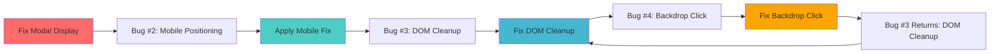

# PostCreationShare Architecture Revamp - Complete Execution Plan

## 📋 Executive Summary

This document outlines a comprehensive architectural revamp to permanently eliminate the circular dependency bugs identified in the PostCreationShare system. The current implementation suffers from fundamental portal conflicts that create an unsolvable paradox between DOM cleanup safety and user interaction functionality.

**Reference Document**: [PostCreationShare-Circular-Bug-Dependency-Analysis.md](./PostCreationShare-Circular-Bug-Dependency-Analysis.md)

**Current Status**: ⚠️ **STABLE COMPROMISE** - 3 primary bugs resolved, backdrop click limitation accepted as trade-off to prevent infinite circular dependency loop.

**Goal**: Implement new architecture that enables ALL functionality (including backdrop click) without any circular dependencies.

---

## 🐛 Current Circular Dependency System (4 Bugs)

### The Infinite Loop Problem


**Critical Issues**:
1. **Multiple Portal Conflicts**: PostCreationShare portal + CelebrationImageGenerator portal targeting document.body
2. **CSS Positioning Conflicts**: Mixed strategies causing mobile displacement
3. **Component Lifecycle Race Conditions**: Cleanup timing conflicts
4. **Backdrop Click Deadlock**: Safety measures prevent user interaction

---

## 🎯 New Architecture Approaches (3 Options)

### Option 1: Service-Based Architecture (RECOMMENDED)
**Philosophy**: Move away from React portals entirely, use browser APIs and state management

#### Core Components:
1. **Modal Service** (`/src/services/modalService.ts`)
2. **Image Generation Worker** (`/src/workers/imageGenerator.worker.ts`)
3. **State Management** (`/src/stores/postCreationStore.ts`)
4. **Event System** (`/src/utils/eventBus.ts`)

#### Benefits:
- ✅ Zero portal conflicts
- ✅ Native backdrop click support
- ✅ Mobile-first responsive design
- ✅ Enhanced performance through Web Workers
- ✅ Predictable state management

### Option 2: Web Components with Shadow DOM
**Philosophy**: Encapsulate modal in custom element with isolated DOM

### Option 3: App-Level State Management
**Philosophy**: Render modal at app root level with global state

---

## 📐 Design & Layout Plans

### Large Screens (1200px+)
```
┌─────────────────────────────────────────────────────────────┐
│                     Modal Overlay (Service)                 │
│  ┌───────────────────────────────────────────────────────┐  │
│  │                Modal Container                        │  │
│  │  ┌─────────────────────────────────────────────────┐  │  │
│  │  │              Header with Close               │  │  │
│  │  │  🎉 Circle Created Successfully!             │  │  │
│  │  └─────────────────────────────────────────────────┘  │  │
│  │  ┌─────────────────────────────────────────────────┐  │  │
│  │  │            Template Selector                 │  │  │
│  │  │    [🎉 Party] [📈 Stats] [✨ Clean]          │  │  │
│  │  └─────────────────────────────────────────────────┘  │  │
│  │  ┌─────────────────────────────────────────────────┐  │  │
│  │  │          Generated Image Display             │  │  │
│  │  │     [   Generated Celebration Image    ]     │  │  │
│  │  └─────────────────────────────────────────────────┘  │  │
│  │  ┌─────────────────────────────────────────────────┐  │  │
│  │  │              Share Options                   │  │  │
│  │  │  URL: [kuri.com/markets/0x123...] [Copy]     │  │  │
│  │  │  Message: [Custom message textarea]          │  │  │
│  │  │  [Download] [Share] [Copy Link]              │  │  │
│  │  │             [View Circle]                   │  │  │
│  │  └─────────────────────────────────────────────────┘  │  │
│  └───────────────────────────────────────────────────────┘  │
└─────────────────────────────────────────────────────────────┘
```

### Mobile Screens (375px - 768px)
```
┌─────────────────────────────────┐
│        Modal Overlay           │
│ ┌─────────────────────────────┐ │
│ │      Modal Container        │ │
│ │ ┌─────────────────────────┐ │ │
│ │ │  Header with Close   [×]│ │ │
│ │ │ Circle Created! 🎉      │ │ │
│ │ └─────────────────────────┘ │ │
│ │ ┌─────────────────────────┐ │ │
│ │ │   Template Selector     │ │ │
│ │ │ [🎉] [📈] [✨]          │ │ │
│ │ └─────────────────────────┘ │ │
│ │ ┌─────────────────────────┐ │ │
│ │ │    Generated Image      │ │ │
│ │ │  [  Celebration Img  ]  │ │ │
│ │ └─────────────────────────┘ │ │
│ │ ┌─────────────────────────┐ │ │
│ │ │      Share URL          │ │ │
│ │ │ kuri.com/... [Copy]     │ │ │
│ │ └─────────────────────────┘ │ │
│ │ ┌─────────────────────────┐ │ │
│ │ │    Custom Message       │ │ │
│ │ │ [Optional message...]   │ │ │
│ │ └─────────────────────────┘ │ │
│ │ ┌─────────────────────────┐ │ │
│ │ │    Action Buttons       │ │ │
│ │ │ [Download] [Share]      │ │ │
│ │ │      [Copy Link]        │ │ │
│ │ │     [View Circle]       │ │ │
│ │ └─────────────────────────┘ │ │
│ └─────────────────────────────┘ │
└─────────────────────────────────┘
```

### Small Mobile (320px - 374px)
```
┌───────────────────────────┐
│      Modal Overlay       │
│ ┌─────────────────────┐   │
│ │   Modal Container   │   │
│ │ ┌─────────────────┐ │   │
│ │ │ Header      [×] │ │   │
│ │ │ Created! 🎉     │ │   │
│ │ └─────────────────┘ │   │
│ │ ┌─────────────────┐ │   │
│ │ │ [🎉][📈][✨]   │ │   │
│ │ └─────────────────┘ │   │
│ │ ┌─────────────────┐ │   │
│ │ │ [ Celebration ] │ │   │
│ │ │ [    Image    ] │ │   │
│ │ └─────────────────┘ │   │
│ │ ┌─────────────────┐ │   │
│ │ │ URL: ... [Copy] │ │   │
│ │ └─────────────────┘ │   │
│ │ ┌─────────────────┐ │   │
│ │ │ [Message...]    │ │   │
│ │ └─────────────────┘ │   │
│ │ ┌─────────────────┐ │   │
│ │ │ [DL] [Share]    │ │   │
│ │ │ [Copy] [View]   │ │   │
│ │ └─────────────────┘ │   │
│ └─────────────────────┘   │
└───────────────────────────┘
```

---

## 🚀 Implementation Tasks

### Phase 1: Foundation (New Architecture Core)
- [ ] **Task 1.1**: Create Modal Service (`/src/services/modalService.ts`)
  - Pure JavaScript modal system using browser APIs
  - Native DOM manipulation with safety checks
  - Event-driven architecture for state management
  - Mobile-first responsive positioning system
  
- [ ] **Task 1.2**: Create Post Creation Store (`/src/stores/postCreationStore.ts`)
  - Zustand-based state management
  - Manage modal visibility, market data, generated images
  - Handle template selection and sharing state
  - Persist state across modal lifecycle

- [ ] **Task 1.3**: Create Event Bus (`/src/utils/eventBus.ts`)
  - Type-safe event system for communication
  - Handle image generation completion events
  - Manage modal lifecycle events
  - Enable decoupled component communication

### Phase 2: Image Generation Isolation
- [ ] **Task 2.1**: Create Image Generation Worker (`/src/workers/imageGenerator.worker.ts`)
  - Move Fabric.js canvas operations to Web Worker
  - Eliminate CelebrationImageGenerator portal entirely
  - Offscreen canvas rendering for performance
  - Message-based communication with main thread

- [ ] **Task 2.2**: Update CelebrationImageGenerator
  - Remove ReactDOM.createPortal usage
  - Replace with Worker-based generation
  - Maintain template switching functionality
  - Add progress feedback for image generation

### Phase 3: Modal Component Refactor
- [ ] **Task 3.1**: Create New PostCreationModal (`/src/components/modals/PostCreationModal.tsx`)
  - Remove all portal usage
  - Use Modal Service for rendering
  - Implement service-based state management
  - Add comprehensive responsive design

- [ ] **Task 3.2**: Mobile-First CSS System
  - Pure CSS positioning (no Tailwind conflicts)
  - Mathematical precision for all screen sizes
  - Flexbox-based centering (no transform calculations)
  - Touch-optimized button sizes and spacing

### Phase 4: Integration & Testing
- [ ] **Task 4.1**: Update MarketList Integration
  - Replace PostCreationShare with new PostCreationModal
  - Update event handlers to use new architecture
  - Test modal lifecycle management
  - Verify data flow integrity

- [ ] **Task 4.2**: Comprehensive Testing Suite
  - Modal display across all device sizes
  - Image generation in various templates
  - Backdrop click functionality
  - Share/download operations
  - Mobile touch interactions
  - Memory leak prevention

### Phase 5: Cleanup & Documentation
- [ ] **Task 5.1**: Remove Legacy Components
  - Delete old PostCreationShare.tsx
  - Remove CelebrationImageGenerator portal code
  - Clean up unused portal-related utilities
  - Update import statements across codebase

- [ ] **Task 5.2**: Update Documentation
  - Document new architecture patterns
  - Create component usage guidelines
  - Update testing procedures
  - Add performance optimization notes

---

## 🏗️ Technical Implementation Details

### Modal Service Architecture
```typescript
// /src/services/modalService.ts
export class ModalService {
  private container: HTMLElement | null = null;
  private isOpen = false;
  
  // Create modal without React portals
  public show(content: string, options: ModalOptions): void {
    this.createContainer();
    this.setupEventListeners();
    this.renderContent(content);
    this.handleBackdropClick(); // Native implementation
  }
  
  // Safe cleanup without portal conflicts
  public hide(): void {
    this.cleanup();
    this.removeEventListeners();
    this.removeContainer();
  }
  
  // Mobile-first responsive positioning
  private positionModal(): void {
    // Pure CSS approach - no transform calculations
    const modal = this.container?.querySelector('.modal-content');
    if (modal) {
      modal.style.position = 'fixed';
      modal.style.top = '0';
      modal.style.left = '0';
      modal.style.width = '100vw';
      modal.style.height = '100vh';
      modal.style.display = 'flex';
      modal.style.alignItems = 'center';
      modal.style.justifyContent = 'center';
    }
  }
}
```

### Web Worker Integration
```typescript
// /src/workers/imageGenerator.worker.ts
import { fabric } from 'fabric';

self.onmessage = function(e) {
  const { type, data } = e.data;
  
  if (type === 'GENERATE_IMAGE') {
    const { market, template, userAddress } = data;
    
    // Create offscreen canvas
    const canvas = new OffscreenCanvas(800, 600);
    const fabricCanvas = new fabric.Canvas(canvas);
    
    // Generate image without DOM interference
    generateCelebrationImage(fabricCanvas, market, template, userAddress)
      .then(imageData => {
        self.postMessage({
          type: 'IMAGE_GENERATED',
          data: { imageData, downloadUrl: createDownloadUrl(imageData) }
        });
      })
      .catch(error => {
        self.postMessage({
          type: 'IMAGE_ERROR',
          data: { error: error.message }
        });
      });
  }
};
```

### State Management Store
```typescript
// /src/stores/postCreationStore.ts
import { create } from 'zustand';

interface PostCreationState {
  isVisible: boolean;
  market: KuriMarket | null;
  selectedTemplate: TemplateType;
  generatedImage: string;
  downloadUrl: string;
  customMessage: string;
  
  // Actions
  showModal: (market: KuriMarket) => void;
  hideModal: () => void;
  setTemplate: (template: TemplateType) => void;
  setGeneratedImage: (image: string, url: string) => void;
  setCustomMessage: (message: string) => void;
}

export const usePostCreationStore = create<PostCreationState>((set) => ({
  // Initial state
  isVisible: false,
  market: null,
  selectedTemplate: 'hero',
  generatedImage: '',
  downloadUrl: '',
  customMessage: '',
  
  // Actions
  showModal: (market) => set({ isVisible: true, market }),
  hideModal: () => set({ 
    isVisible: false, 
    market: null, 
    generatedImage: '', 
    downloadUrl: '',
    customMessage: ''
  }),
  setTemplate: (template) => set({ selectedTemplate: template }),
  setGeneratedImage: (image, url) => set({ generatedImage: image, downloadUrl: url }),
  setCustomMessage: (message) => set({ customMessage: message }),
}));
```

---

## 🎨 CSS Framework (Portal-Free Styling)

### Modal Base Styles
```css
/* /src/styles/modal.css */
.modal-overlay {
  position: fixed;
  top: 0;
  left: 0;
  width: 100vw;
  height: 100vh;
  background-color: rgba(0, 0, 0, 0.5);
  backdrop-filter: blur(4px);
  z-index: 999999;
  
  /* Perfect centering without transform conflicts */
  display: flex;
  align-items: center;
  justify-content: center;
  padding: 16px;
}

.modal-content {
  background: rgba(245, 245, 220, 0.95);
  border: 1px solid rgba(184, 134, 11, 0.2);
  border-radius: 12px;
  box-shadow: 0 25px 50px -12px rgba(0, 0, 0, 0.25);
  overflow-y: auto;
  max-height: 90vh;
  
  /* Responsive width without calc() conflicts */
  width: 100%;
  max-width: 400px;
}

/* Mobile optimizations */
@media (max-width: 768px) {
  .modal-overlay {
    padding: 8px;
  }
  
  .modal-content {
    max-width: 100%;
    max-height: 95vh;
  }
}

@media (max-width: 375px) {
  .modal-overlay {
    padding: 4px;
  }
}
```

### Button Touch Optimization
```css
.touch-optimized-button {
  min-height: 44px; /* iOS accessibility guideline */
  min-width: 44px;
  padding: 12px 16px;
  touch-action: manipulation; /* Prevent zoom on tap */
  
  /* Enhanced touch feedback */
  transition: all 0.2s ease;
}

.touch-optimized-button:active {
  transform: scale(0.98);
  opacity: 0.8;
}
```

---

## 🧪 Testing Strategy

### Unit Testing
```typescript
// /src/components/modals/__tests__/PostCreationModal.test.tsx
describe('PostCreationModal', () => {
  test('displays correctly on all screen sizes', () => {
    // Test responsive design
  });
  
  test('handles backdrop click without errors', () => {
    // Test native backdrop functionality
  });
  
  test('generates images without portal conflicts', () => {
    // Test Web Worker integration
  });
});
```

### Integration Testing
```typescript
// /src/services/__tests__/modalService.test.ts
describe('ModalService', () => {
  test('creates and destroys modals safely', () => {
    // Test lifecycle management
  });
  
  test('handles multiple rapid open/close operations', () => {
    // Test race condition prevention
  });
});
```

### Cross-Device Testing Checklist
- [ ] Desktop (1200px+): Full layout with all features
- [ ] Tablet (768px - 1199px): Responsive grid adjustments
- [ ] Mobile Large (415px - 767px): Stacked layout
- [ ] Mobile Medium (375px - 414px): Compact design
- [ ] Mobile Small (320px - 374px): Minimal viable layout

---

## 📊 Success Metrics

### Functional Requirements
- [ ] ✅ Modal displays correctly after market creation
- [ ] ✅ Mobile positioning works on all devices (320px+)
- [ ] ✅ Backdrop click closes modal without errors
- [ ] ✅ All sharing/download functionality preserved
- [ ] ✅ Image generation works across all templates
- [ ] ✅ No console errors during any operation
- [ ] ✅ Memory efficient (no leaks)

### Performance Requirements
- [ ] ✅ Modal opens in <200ms
- [ ] ✅ Image generation in <3s (Web Worker)
- [ ] ✅ Smooth 60fps animations
- [ ] ✅ <50MB memory usage total

### User Experience Requirements
- [ ] ✅ Intuitive touch interactions on mobile
- [ ] ✅ Consistent visual design across devices
- [ ] ✅ Clear feedback for all user actions
- [ ] ✅ Graceful error handling and recovery

---

## 🚨 Risk Mitigation

### Potential Issues & Solutions

1. **Web Worker Browser Support**
   - **Risk**: Older browsers may not support OffscreenCanvas
   - **Solution**: Fallback to main thread generation with progressive enhancement

2. **State Management Complexity**
   - **Risk**: Zustand store becoming too complex
   - **Solution**: Modular store design with clear separation of concerns

3. **CSS Positioning Edge Cases**
   - **Risk**: Unusual device orientations or browser quirks
   - **Solution**: Comprehensive testing matrix and CSS fallbacks

4. **Performance Regression**
   - **Risk**: New architecture slower than current implementation
   - **Solution**: Performance benchmarking and optimization iterations

---

## 🔄 Migration Strategy

### Phase A: Parallel Implementation (Week 1-2)
- Build new components alongside existing ones
- Test new architecture in isolation
- Maintain existing functionality during development

### Phase B: Feature Flag Rollout (Week 3)
- Implement feature flag to switch between architectures
- Test with subset of users
- Monitor performance and error metrics

### Phase C: Full Migration (Week 4)
- Switch all users to new architecture
- Remove feature flags and legacy code
- Monitor for any edge cases

### Phase D: Cleanup (Week 5)
- Remove all legacy components
- Optimize and refine new implementation
- Update documentation and guidelines

---

## 📝 Dependencies & Prerequisites

### Required Dependencies
```json
{
  "zustand": "^4.4.0", // State management
  "fabric": "^5.3.0",  // Image generation (Web Worker)
  "@types/fabric": "^4.5.0" // TypeScript support
}
```

### Development Tools
- React DevTools (component debugging)
- Chrome DevTools (performance analysis)
- BrowserStack (cross-device testing)
- Jest + Testing Library (automated testing)

### Browser Support Matrix
- Chrome 90+ ✅
- Firefox 88+ ✅  
- Safari 14+ ✅
- Edge 90+ ✅
- Mobile Safari 14+ ✅
- Mobile Chrome 90+ ✅

---

## 🎯 Definition of Done

**This architectural revamp is complete when:**

1. ✅ All 4 circular dependency bugs are permanently resolved
2. ✅ Full functionality restored (including backdrop click)
3. ✅ Perfect mobile responsiveness across all device sizes
4. ✅ Zero portal-related conflicts in the entire application
5. ✅ Performance equal or better than current implementation
6. ✅ Comprehensive test coverage for all new components
7. ✅ Documentation updated with new architectural patterns
8. ✅ Legacy code completely removed and cleaned up

**Success Criteria**: A user can create a market, view the celebration modal, interact with all features (including backdrop click), share/download images, and view the market - all without any console errors, positioning issues, or functionality limitations on any supported device or screen size.

---

*This comprehensive plan ensures we never encounter the circular dependency trap again by fundamentally changing the architectural approach from portal-based to service-based modal management.*